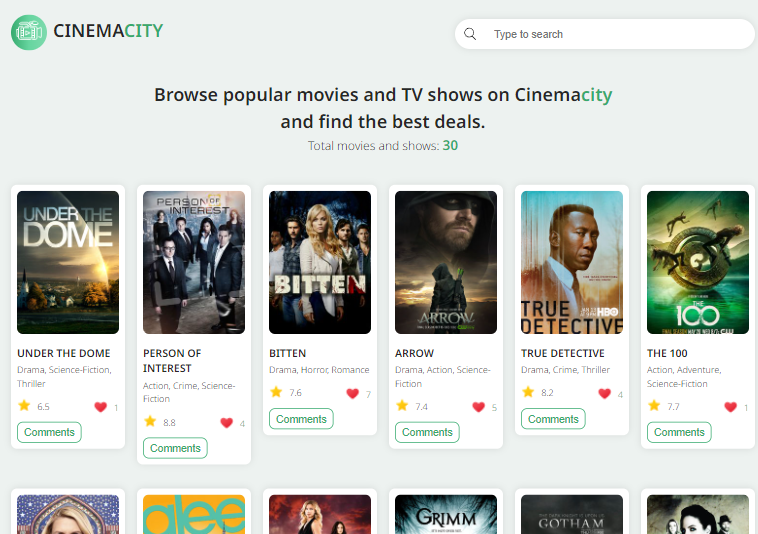
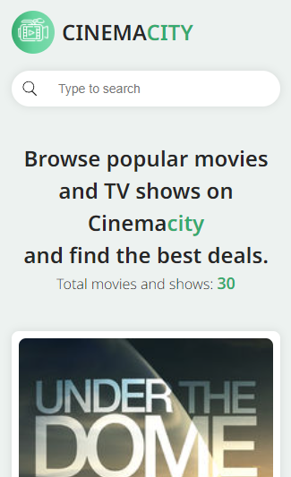

# Best Movies List - Capstone Project Project

In this javascript capstone project, we have build a web applications that is based on an extrenal API.
We have built a movie list web application that displays movies from the API.

## Screenshots
> Destop Version


>Mobile Vesrion



## Built With

- HTML
- CSS
- JavaScript / ES6
- Webpack


## Getting Started


### Prerequisites
- browser (e.g. Google Chrome)
- text editor (e.g. VSCode)
- terminal/CLI

### Clone the repository

```
https://github.com/kelvinbush/movie-capstone
```

### Deployment

- The project is deployed with Github pages.


## Authors

👤 **Nabil Hayoun**

- GitHub: [@NabilHY](https://github.com/NabilHY)
- Twitter: [@NeoNabil2](https://twitter.com/NeoNabil2)

👤 **Kelvin Bush**

- GitHub: [@kelvinbush](https://github.com/kelvinbush)


## 🤝 Contributing

Contributions, issues, and feature requests are welcome!

Feel free to check the [issues page](../../issues/).

## Show your support

Give a ⭐️ if you like this project!


## 📝 License

This project is [MIT](./MIT.md) licensed